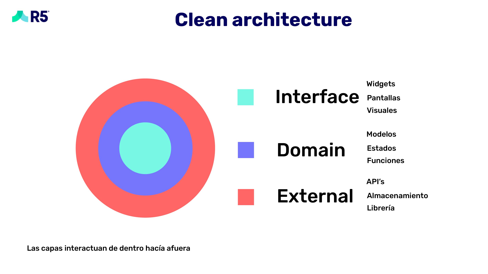

# R5 ToDo

## :book: Arquitectura y gestión de estados

Para la arquitectura completa del proyecto exceptuando las Cloud Functions se usó una variante de Clean Architecture con el gestor de estados Provider y la inyección de dependencias para que el flujo sea coherente con el bajo acoplamiento de los modulos.

Por lo tanto los modulos se componen de las 3 capas mencionadas y una clase que está fuera de todas las clases que sería la inyección de dependencias.

lib
└── modulo
    ├── interface
    │   ├── widgets
    │   │   └── modulo_widget.dart
    │   └── modulo_page.dart
    ├── external
    │   └── modulo_external.dart
    ├── domain
    │   ├── modulo_provider.dart
    │   └── models
    │       └── modulo_model.dart
    └── modulo_injection.dart

## :mag: Navegación

Siguiendo esta estructura a dónde se hace la navegación no es al Scaffold() como de costumbre si no a la inyección que tiene de hijo la clase del Scaffold()

## :closed_lock_with_key: Autenticatión

En la autenticación se usa Firebase Auth tanto para login como para la creación del usuario, ambas están validas en la app, si se crea un usuario en el instante que se crea, la app lo loggea consecutivamente.

## :floppy_disk: Obtención, escritura de datos y Cloud Functions

La BD es Firebase y las funciones de nube ocurren en Google Cloud Functions.
Para la obtención de la lista de tareas se utiliza un Stream, esto para que cuando la tarea se actualice o se marque como finalizada los cambios se vean reflejados de forma instantanea en el aplicativo y sea intuitiva con la rápida interacción de los usuarios.

Para Cloud Functions se usó JavaScript con reglas de tipado EsLint y se encuentran en la carpeta /functions del proyecto como la unica tarea que debía de ocurrir en la nube era la de la traducción se usó solo el paquete @google-cloud/translate v2 y firebase functions. El texto traducido se guarda en el campo contentTranslated y titleTranslated

## :file_folder: Estructura de Firebase

Estructura:
{uid}
└── {documentId}
    ├── content
    ├── contentTranslated
    ├── displayDate
    ├── isFinished
    ├── timeStamp
    ├── title
    ├── titleTranslated
    └── uid

##  Contacto

:speech_balloon: Ese numero de Whatsapp es solo de Whatsapp no de llamadas el de llamadas es: **3027493759**
